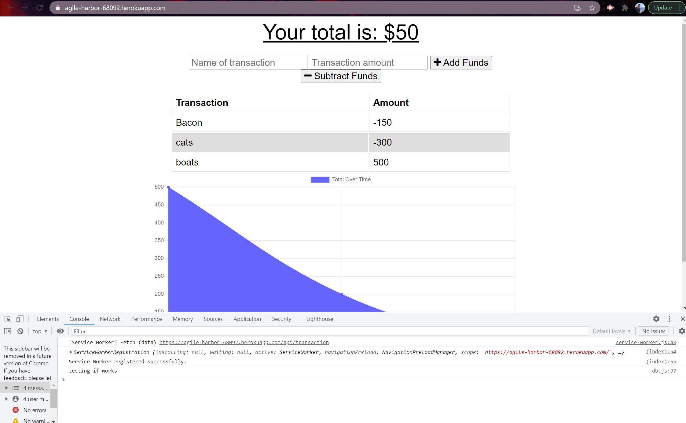
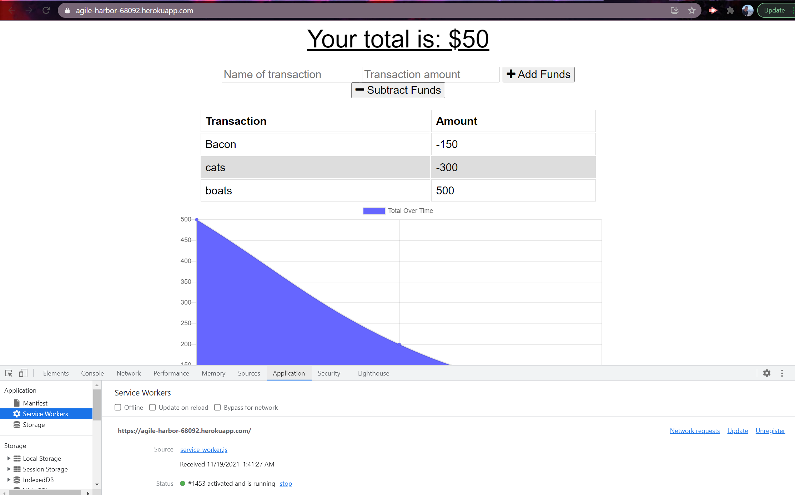
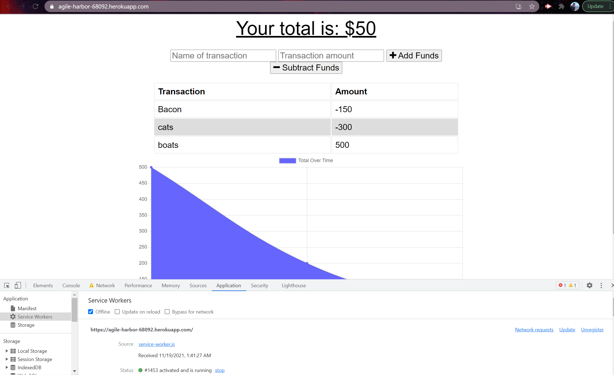

# BudgetTracker
This Budget Tracker application is designed to function while a user is online and if they are offline. With the ability to update their budgeting information away from from and on the go, it is essential an app such as this one works properly to give users that power to work on the go without worry that their work wont be updated. The purpose for this application is exactly that. Updating your budget offline and/or lonline has never been easier!


### Prerequisites

-Heroku

-Install Node

-Install VS Studio Code


### Installing

-NPM install in integrated terminal


-run the command in your terminal: 
```
*node server.js*
```

-Open in your browser, Localhost3000 , and you will be directed to the functioning WorkoutTracker application.


## Screenshot of site








## Built With

* [HTML](https://developer.mozilla.org/en-US/docs/Web/HTML)
* [CSS](https://developer.mozilla.org/en-US/docs/Web/CSS)
* [Javascript](https://developer.mozilla.org/en-US/docs/Web/JavaScript)
* [Mongodb](https://docs.mongodb.com/)

## Deployed Link

* [See Live Site](https://agile-harbor-68092.herokuapp.com/)


## Authors

* **George Sandoval** 

- [Link to Portfolio Site](https://gsandoval09.github.io/UpdatedProfessionalPortfolio/)
- [Link to Github](https://github.com/gsandoval09)
- [Link to LinkedIn](www.linkedin.com/in/george-sandoval-4467641b3)


## License

This project is licensed under the MIT License 

## Acknowledgments

* Google
* w3schools
* Mozilla
